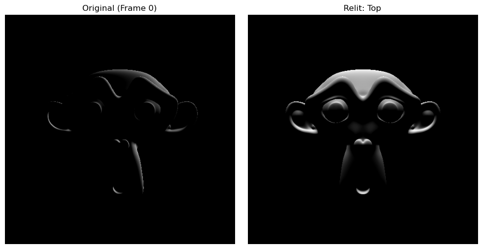

# Video Relighting with Correspondence-Based Reflectance Extraction

## Fixed Camera + Rotating Object Pipeline

**Author:** Abel & Team  
**Date:** January 2026  
**Status:** ✅ Verified and Working

---

## Overview

This project demonstrates how to capture and relight video of a 3D object using **correspondence-based reflectance extraction**. The key insight is that when the camera is fixed and only the object rotates, we must track surface points across frames using vertex IDs.

### Key Results

| Metric | Value |
|--------|-------|
| MSE | ~0.00000038 |
| Correlation | ~0.999996 |
| Verification | ✅ PASSED |

---

## The Pipeline

```
┌─────────────────────────────────────────────────────────────────────┐
│  SCRIPT 1: render.py (Blender)                                      │
│  - Renders rotating object with fixed camera                        │
│  - Outputs: lit images, vertex ID maps, normal maps                 │
└─────────────────────────────────────────────────────────────────────┘
                                │
                                ▼
┌─────────────────────────────────────────────────────────────────────┐
│  SCRIPT 2: build_correspondence.py (Python)                         │
│  - Reads vertex ID maps                                             │
│  - Builds mapping: vertex → [(frame, y, x), ...]                    │
└─────────────────────────────────────────────────────────────────────┘
                                │
                                ▼
┌─────────────────────────────────────────────────────────────────────┐
│  SCRIPT 3: extract_reflectance.py (Python)                          │
│  - Samples intensity at corresponding pixels                        │
│  - Computes ground truth: I = max(0, n·l)                           │
│  - Creates 2D reflectance maps for verification                     │
└─────────────────────────────────────────────────────────────────────┘
                                │
                                ▼
┌─────────────────────────────────────────────────────────────────────┐
│  SCRIPT 4: relight_video.py (Python)                                │
│  - Demonstrates video relighting with new light directions          │
│  - Creates comparison GIFs and multi-light images                   │
└─────────────────────────────────────────────────────────────────────┘
```

---

## Quick Start

### Option 1: Bash Script (Mac/Linux)

```bash
# Make executable
chmod +x run_pipeline.sh

# Run with standard settings
./run_pipeline.sh

# Or with high-resolution for paper-ready results
./run_pipeline.sh --high-res

# Install dependencies if needed
./run_pipeline.sh --install
```

### Option 2: Manual Execution

```bash
# 1. Render in Blender
blender --background --python render.py

# 2. Build correspondence map
python3 build_correspondence.py

# 3. Extract reflectance and verify
python3 extract_reflectance.py

# 4. Create relighting demo
python3 relight_video.py
```

### Option 3: Windows (PowerShell)

```powershell
# 1. Render in Blender
& "C:\Program Files\Blender Foundation\Blender 5.0\blender.exe" --background --python render.py

# 2. Build correspondence map
python build_correspondence.py

# 3. Extract reflectance
python extract_reflectance.py

# 4. Create relighting demo
python relight_video.py
```

---

## Requirements

### Software
- **Blender 3.0+** (tested with 5.0)
- **Python 3.8+**

### Python Packages
```bash
pip install numpy matplotlib imageio
```

---

## Output Files

```
final/
├── render.py                    # Script 1: Blender rendering
├── build_correspondence.py      # Script 2: Correspondence builder
├── extract_reflectance.py       # Script 3: Reflectance extraction
├── relight_video.py             # Script 4: Video relighting
├── run_pipeline.sh              # Bash automation script
├── README.md                    # This file
│
├── renders/                     # Rendered images (EXR)
│   ├── theta_000.exr           # Lit image
│   ├── theta_000_vertexid.exr  # Vertex ID map
│   ├── theta_000_normal.exr    # Normal map
│   └── metadata.json           # Render parameters
│
├── correspondence/              # Correspondence data
│   ├── correspondence_map.json # Vertex → pixel mapping
│   └── stats.json              # Statistics
│
├── output/                      # Analysis results
│   ├── reflectance_map_2d.png  # 2D reflectance heatmap
│   ├── verification.png        # Verification plots
│   ├── results.json            # Numerical results
│   ├── multi_light.png         # Multi-lighting demo
│   ├── relighting_comparison.gif
│   └── relit_frames/           # Individual relit frames
│
├── docs/                        # Documentation images
│   ├── reflectance_map_2d.png
│   ├── verification.png
│   ├── multi_light.png
│   └── relighting_comparison.gif
│
└── logs/                        # Execution logs
    ├── render.log
    ├── correspondence.log
    ├── reflectance.log
    └── relighting.log
```

---

## Mathematical Foundation

### Lambertian Reflectance Model

For diffuse surfaces, the observed intensity depends on the angle between the surface normal and light direction:

$$I = \max(0, \mathbf{n} \cdot \mathbf{l})$$

Where:
- $\mathbf{n}$ = surface normal (unit vector)
- $\mathbf{l}$ = light direction (unit vector)
- $I$ = intensity in [0, 1]

### Why Correspondence Tracking?

When the camera is fixed and only the object rotates:
- The same **pixel** sees **different surface points** in each frame
- Without tracking, sampling a fixed pixel mixes data from many surfaces
- With vertex ID tracking, we follow the **same physical surface** across frames

### Vertex ID Encoding

Each vertex gets a unique RGB color:
```
R = (vertex_index % 256) / 255
G = ((vertex_index // 256) % 256) / 255
B = ((vertex_index // 65536) % 256) / 255
```

This supports up to 16.7 million vertices!

---

## Configuration Parameters

### Standard Settings (Testing)
- Resolution: 512×512
- Theta samples: 72 (5° steps)
- Subdivision: Level 3 (~32,000 vertices)

### High-Resolution Settings (Paper)
- Resolution: 1024×1024
- Theta samples: 360 (1° steps)
- Subdivision: Level 4 (~128,000 vertices)

To modify, edit the CONFIGURATION section in `render.py`.

---

## Verification

The pipeline verifies correctness by comparing:
- **Measured intensity**: Sampled from rendered lit images via correspondence
- **Ground truth**: Computed as max(0, n·l) using normal maps

A correlation of ~0.999+ indicates the method works correctly!

---

## Outputs for Paper

### 2D Reflectance Map


Shows measured vs ground truth reflectance for multiple surface points.

### Multi-Light Relighting


Demonstrates relighting with different virtual light directions.

### Relighting Comparison


Animated comparison of original vs relit video.

---

## Troubleshooting

### "Blender not found"
Set the BLENDER_PATH environment variable:
```bash
export BLENDER_PATH="/path/to/blender"
```

### "imageio not found"
```bash
pip install imageio
```

### Low correlation values
- Check that normal maps are in world space (not object space)
- Verify light direction matches between rendering and extraction
- Ensure subdivision is applied before vertex ID baking

---

## Citation

If you use this code in your research, please cite:

```bibtex
@misc{video-relighting-2026,
  author = {Abel and Team},
  title = {Video Relighting with Correspondence-Based Reflectance Extraction},
  year = {2026},
  publisher = {GitHub},
  url = {https://github.com/abel2002-01/video-regeneration-3}
}
```

---

## License

MIT License - See LICENSE file for details.

---

*Last updated: January 2026*

